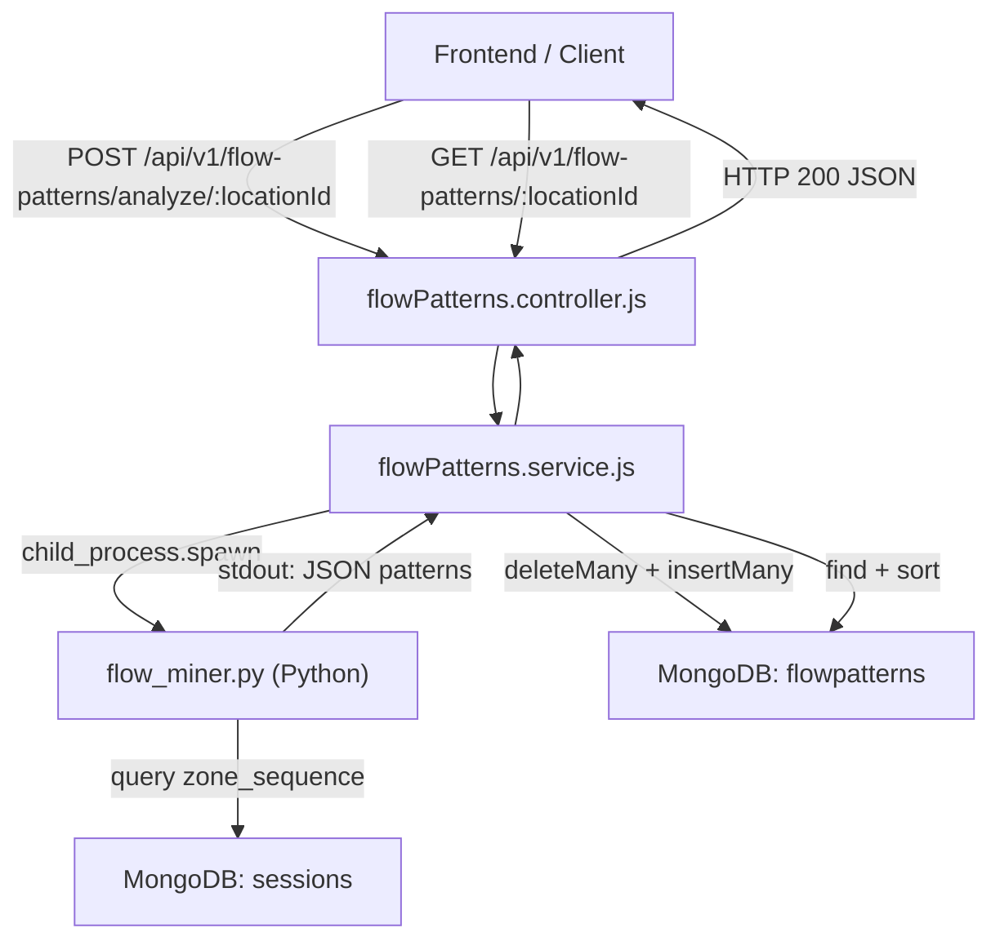

# Design Document: FP-Growth Flow Mining

## Tổng quan (Overview)

Tính năng **FP-Growth Flow Mining** khai phá các mẫu di chuyển (flow patterns) của khách hàng qua các zone trong một location bằng thuật toán FP-Growth. Kiến trúc gồm hai lớp chính:

1. **Python Script** (`flow_miner.py`): Kết nối MongoDB, trích xuất zone sequences, chạy FP-Growth qua `mlxtend`, xuất kết quả JSON ra stdout.
2. **Node.js Layer** (service + controller + routes): Spawn Python script, parse output, lưu vào MongoDB, expose REST API.

Luồng dữ liệu một chiều: `HTTP Request → Controller → Service → spawn Python → MongoDB → HTTP Response`.

---

## Kiến trúc (Architecture)



### Luồng phân tích (Analyze Flow)

```
POST /analyze/:locationId
        │
        ▼
analyzeFlowPatternsController
        │  extract locationId, {minSupport, minConfidence, minLift} from body
        ▼
saveFlowPatterns(locationId, options)
        │  spawn python flow_miner.py <locationId> <minSupport> <minConfidence> <minLift>
        ▼
FPGrowthMiner.run()
        │  fetch_sequences → preprocess → fpgrowth → association_rules → filter lift → format_final
        │  stdout: { "patterns": [...], "error": null }
        ▼
Service: parse JSON → deleteMany(location_id) → insertMany(patterns + location_id + update_at)
        │
        ▼
HTTP 200: { data: savedPatterns }
```

### Luồng truy vấn (Get Flow)

```
GET /:locationId
        │
        ▼
getFlowPatternsController
        │
        ▼
getFlowPatterns(locationId)
        │  FlowPatterns.find({ location_id }).sort({ create_at: -1 })
        ▼
HTTP 200: { data: patterns[] }
```

---

## Components và Interfaces

### 1. `MODULE_BE/scripts/flow_miner.py`

**Class `FPGrowthMiner`**

```python
class FPGrowthMiner:
    def __init__(self, location_id: str, min_support: float = 0.1,
                 min_confidence: float = 0.5, min_lift: float = 1.0):
        """
        Khởi tạo miner với location_id và các ngưỡng lọc.
        Kết nối MongoDB qua MONGODB_URI env var.
        """

    def fetch_sequences(self) -> list[list[str]]:
        """
        Query sessions theo location_id từ MongoDB.
        Trả về list các zone_sequence (mỗi sequence là list zone_id đã sort theo entry_time).
        Lọc bỏ sequences có độ dài <= 1.
        """

    def preprocess(self, sequences: list[list[str]]) -> pd.DataFrame:
        """
        Dùng TransactionEncoder để encode sequences thành DataFrame boolean.
        Trả về DataFrame với columns là zone_id, rows là sessions.
        """

    def run(self) -> dict:
        """
        Điều phối toàn bộ pipeline:
          1. fetch_sequences()
          2. preprocess()
          3. fpgrowth(min_support, use_colnames=True)
          4. association_rules(metric='confidence', min_threshold=min_confidence)
          5. Lọc rules có lift >= min_lift
          6. format_final(rules)
        Trả về dict { "patterns": [...], "error": null } hoặc { "patterns": [], "error": "..." }
        """

    def format_final(self, rules: pd.DataFrame) -> list[dict]:
        """
        Chuyển đổi DataFrame rules thành list pattern objects.
        Convert frozenset → list[str] cho antecedents/consequents.
        Mỗi object: { pattern_type, antecedent_zones, consequent_zones,
                      support_score, confidence_score, lift_score }
        """
```

**CLI Interface:**
```
python flow_miner.py <location_id> <min_support> <min_confidence> <min_lift>
```

**stdout output format:**
```json
{
  "patterns": [
    {
      "pattern_type": "association_rule",
      "antecedent_zones": ["zone_A"],
      "consequent_zones": ["zone_B"],
      "support_score": 0.35,
      "confidence_score": 0.72,
      "lift_score": 1.85
    }
  ],
  "error": null
}
```

---

### 2. `MODULE_BE/scripts/requirements.txt`

```
pymongo==4.7.2
mlxtend==0.23.1
pandas==2.2.2
python-dotenv==1.0.1
```

---

### 3. `MODULE_BE/src/service/flowPatterns.service.js`

```js
/**
 * saveFlowPatterns({ locationId, minSupport, minConfidence, minLift })
 *   - Spawn Python script với các tham số
 *   - Parse stdout JSON
 *   - deleteMany cũ theo location_id
 *   - insertMany patterns mới (gán location_id + update_at)
 *   - Trả về mảng documents đã lưu
 *
 * getFlowPatterns({ locationId })
 *   - find({ location_id: locationId }).sort({ create_at: -1 })
 *   - Trả về mảng FlowPattern documents
 */
```

**Signatures:**
```js
saveFlowPatterns({ locationId, minSupport = 0.1, minConfidence = 0.5, minLift = 1.0 }): Promise<FlowPattern[]>
getFlowPatterns({ locationId }): Promise<FlowPattern[]>
```

---

### 4. `MODULE_BE/src/controllers/flowPatterns.controller.js`

```js
/**
 * analyzeFlowPatternsController - POST /analyze/:locationId
 *   - Lấy locationId từ req.params
 *   - Lấy { minSupport, minConfidence, minLift } từ req.body (optional)
 *   - Gọi flowPatternsService.saveFlowPatterns(...)
 *   - Trả về success({ data, message, code: 200 })
 *
 * getFlowPatternsController - GET /:locationId
 *   - Lấy locationId từ req.params
 *   - Gọi flowPatternsService.getFlowPatterns(...)
 *   - Trả về success({ data, message, code: 200 })
 */
```

---

### 5. `MODULE_BE/src/routes/flowPatterns.routes.js`

```
POST /analyze/:locationId  → analyzeFlowPatternsController
GET  /:locationId          → getFlowPatternsController
```

---

### 6. `MODULE_BE/src/routes/index.route.js` (update)

Thêm dòng:
```js
const flowPatternsRoutes = require("./flowPatterns.routes");
app.use(`${version}/flow-patterns`, flowPatternsRoutes);
```

---

## Data Models

### Input: Session Document (MongoDB)

```js
{
  location_id: String,          // filter key
  zone_sequence: [
    {
      zone_id: String,          // extracted as transaction item
      entry_time: Date,         // sort key
      exit_time: Date,
      dwell_time_seconds: Number
    }
  ]
}
```

### Intermediate: Zone Sequence (Python)

```python
# Sau khi fetch và sort theo entry_time
sequences = [
    ["zone_A", "zone_B", "zone_C"],  # session 1
    ["zone_A", "zone_C"],             # session 2
    ...
]

# Sau TransactionEncoder
#        zone_A  zone_B  zone_C
# sess1   True    True    True
# sess2   True    False   True
```

### Output: FlowPattern Document (MongoDB)

```js
{
  location_id: String,          // gán bởi service
  pattern_type: "association_rule",
  antecedent_zones: [String],   // converted từ frozenset
  consequent_zones: [String],   // converted từ frozenset
  support_score: Number,        // [0, 1]
  confidence_score: Number,     // [0, 1]
  lift_score: Number,           // > 0, meaningful khi > 1
  create_at: Date,
  update_at: Date               // gán bởi service khi save
}
```

### API Response Format

```json
{
  "status": "success",
  "message": "Flow patterns analyzed successfully",
  "data": [ /* FlowPattern[] */ ]
}
```

---

## Correctness Properties

*A property là một đặc tính hoặc hành vi phải đúng trong tất cả các lần thực thi hợp lệ của hệ thống — về cơ bản là một phát biểu hình thức về những gì hệ thống phải làm. Properties là cầu nối giữa đặc tả dạng ngôn ngữ tự nhiên và đảm bảo tính đúng đắn có thể kiểm chứng tự động.*

---

### Property 1: Lọc session theo location_id

*Với bất kỳ* tập sessions nào chứa nhiều `location_id` khác nhau, kết quả của `fetch_sequences` chỉ được chứa các sessions có đúng `location_id` được yêu cầu — không có session nào của location khác lọt vào.

**Validates: Requirements 1.2**

---

### Property 2: Zone sequence được sắp xếp theo entry_time

*Với bất kỳ* session nào có `zone_sequence` với thứ tự `entry_time` ngẫu nhiên, sau khi `preprocess`, danh sách `zone_id` trong sequence phải được sắp xếp theo `entry_time` tăng dần (tức là `entry_time[i] <= entry_time[i+1]` với mọi `i`).

**Validates: Requirements 1.3**

---

### Property 3: Lọc bỏ session có ít hơn 2 zones

*Với bất kỳ* tập sessions nào (bao gồm cả sessions có 0, 1, hoặc nhiều zones), sau khi `preprocess`, tất cả sequences trong output phải có độ dài ≥ 2. Không có sequence nào có độ dài 0 hoặc 1 được giữ lại.

**Validates: Requirements 1.4**

---

### Property 4: Tăng min_support không làm tăng số frequent itemsets

*Với bất kỳ* tập zone sequences hợp lệ và hai ngưỡng `s1 <= s2`, số lượng frequent itemsets tìm được với `min_support = s2` phải nhỏ hơn hoặc bằng số lượng tìm được với `min_support = s1` (tính chất đơn điệu của support threshold).

**Validates: Requirements 2.2**

---

### Property 5: Tất cả rules trong output đều thỏa min_lift

*Với bất kỳ* tập association rules nào và bất kỳ giá trị `min_lift` nào, tất cả rules trong output của bước lọc phải có `lift_score >= min_lift`. Không có rule nào vi phạm ngưỡng lift được giữ lại.

**Validates: Requirements 2.4**

---

### Property 6: Output luôn là valid JSON với đầy đủ trường bắt buộc

*Với bất kỳ* tập zone sequences hợp lệ, `format_final` phải trả về một chuỗi JSON parseable, và mỗi pattern object trong mảng `patterns` phải chứa đầy đủ 6 trường: `pattern_type` (string, giá trị `"association_rule"`), `antecedent_zones` (array of string), `consequent_zones` (array of string), `support_score` (number), `confidence_score` (number), `lift_score` (number). Không có `frozenset` nào được xuất hiện trong output.

**Validates: Requirements 3.1, 3.2, 3.3, 3.4**

---

### Property 7: Save patterns thay thế hoàn toàn patterns cũ

*Với bất kỳ* tập patterns mới nào và bất kỳ patterns cũ nào đang tồn tại trong DB cho cùng `location_id`, sau khi `saveFlowPatterns` hoàn thành, collection `FlowPatterns` chỉ chứa patterns mới — tất cả patterns cũ của `location_id` đó đã bị xóa.

**Validates: Requirements 4.3**

---

### Property 8: Mỗi pattern được lưu đều có location_id và update_at đúng

*Với bất kỳ* tập patterns nào được lưu bởi `saveFlowPatterns`, tất cả documents trong DB phải có `location_id` bằng đúng `locationId` được truyền vào, và `update_at` là một giá trị `Date` hợp lệ (không null, không undefined).

**Validates: Requirements 4.4**

---

### Property 9: getFlowPatterns trả về kết quả theo thứ tự create_at giảm dần

*Với bất kỳ* tập FlowPatterns nào có `create_at` khác nhau, `getFlowPatterns` phải trả về mảng được sắp xếp sao cho `create_at[i] >= create_at[i+1]` với mọi `i` (thứ tự giảm dần).

**Validates: Requirements 4.7**

---

### Property 10: Default values được áp dụng khi thiếu tham số

*Với bất kỳ* subset nào của `{min_support, min_confidence, min_lift}` bị thiếu trong request body, CLI arguments truyền vào Python script phải chứa đúng giá trị mặc định tương ứng: `min_support = 0.1`, `min_confidence = 0.5`, `min_lift = 1.0`.

**Validates: Requirements 6.3, 6.4, 6.5**

---

## Error Handling

### Python Script (`flow_miner.py`)

| Tình huống | Xử lý |
|---|---|
| Không có session nào sau khi lọc | Xuất `{"patterns": [], "error": null}`, exit 0 |
| Không tìm được frequent itemset | Xuất `{"patterns": [], "error": null}`, exit 0 |
| Lỗi kết nối MongoDB | Xuất `{"patterns": [], "error": "<message>"}`, exit 1 |
| Lỗi trong quá trình chạy thuật toán | Xuất `{"patterns": [], "error": "<message>"}`, exit 1 |
| Thiếu tham số CLI | argparse tự động in usage và exit 2 |

**Nguyên tắc:** Script **không bao giờ** in ra stderr trực tiếp cho lỗi logic — tất cả lỗi được đóng gói trong JSON stdout để Node.js parse được. Chỉ dùng stderr cho debug logging nếu cần.

### Node.js Service (`flowPatterns.service.js`)

| Tình huống | Xử lý |
|---|---|
| Python script exit code != 0 | `throw new Error(stderrOutput)` |
| stdout không parse được thành JSON | `throw new Error("Invalid JSON output from Python script")` |
| Python trả về `error != null` | `throw new Error(parsedOutput.error)` |
| `patterns` là mảng rỗng | Không xóa DB cũ, trả về `[]` (không có gì để lưu) |
| MongoDB insertMany thất bại | Propagate error lên controller |

### Node.js Controller (`flowPatterns.controller.js`)

| Tình huống | Xử lý |
|---|---|
| `locationId` không có trong params | `return error({ res, message: "Location ID is required", code: 400 })` |
| Service throw error | `catchAsync` bắt và trả về HTTP 500 tự động |

---

## Testing Strategy

### Dual Testing Approach

Tính năng này phù hợp với **property-based testing** cho phần logic Python (lọc, sắp xếp, format) và **example-based testing** cho phần Node.js (controller, service integration).

#### Python — Property-Based Tests (dùng `hypothesis`)

Thư viện: [`hypothesis`](https://hypothesis.readthedocs.io/) — PBT library chuẩn cho Python.

Mỗi property test chạy tối thiểu **100 iterations**.

```python
# Tag format: Feature: fpgrowth-flow-mining, Property <N>: <text>
```

| Property | Test | Mô tả |
|---|---|---|
| Property 1 | `test_fetch_filters_by_location_id` | Generate sessions với nhiều location_id, verify chỉ đúng location được trả về |
| Property 2 | `test_preprocess_sorts_by_entry_time` | Generate zone_sequence với entry_time ngẫu nhiên, verify thứ tự sau sort |
| Property 3 | `test_preprocess_filters_short_sequences` | Generate sessions với 0/1/nhiều zones, verify output chỉ có len >= 2 |
| Property 4 | `test_fpgrowth_monotone_support` | Generate transactions, verify tăng min_support không tăng itemset count |
| Property 5 | `test_filter_lift_threshold` | Generate rules với lift values, verify tất cả output có lift >= min_lift |
| Property 6 | `test_format_final_valid_json_and_schema` | Generate rules, verify JSON parseable và đủ 6 trường đúng type |

#### Python — Example-Based Tests (dùng `pytest`)

- Empty sequences → `{"patterns": [], "error": null}`
- No frequent itemsets → `{"patterns": [], "error": null}`
- Exception trong run → `{"patterns": [], "error": "..."}`
- CLI argument parsing đúng

#### Node.js — Example-Based Tests (dùng `jest` + `jest-mock`)

Thư viện: `jest` (đã có trong project theo `jest.config.js`).

| Test | Mô tả |
|---|---|
| `saveFlowPatterns` - happy path | Mock spawn trả về valid JSON, verify deleteMany + insertMany được gọi |
| `saveFlowPatterns` - Python error | Mock spawn trả về `{error: "..."}`, verify throw Error |
| `saveFlowPatterns` - spawn fail | Mock spawn exit code 1, verify throw Error |
| `saveFlowPatterns` - empty patterns | Mock spawn trả về `{patterns: []}`, verify không gọi deleteMany |
| `getFlowPatterns` | Mock find().sort(), verify trả về đúng kết quả |
| Controller - missing locationId | Verify HTTP 400 |
| Controller - service success | Verify HTTP 200 với data |
| Controller - service throws | Verify catchAsync trả về 500 |

#### Node.js — Property-Based Tests (dùng `fast-check`)

Thư viện: [`fast-check`](https://fast-check.dev/) — PBT library cho JavaScript/TypeScript.

| Property | Test | Mô tả |
|---|---|---|
| Property 7 | `test_save_replaces_old_patterns` | Generate old + new patterns, verify chỉ new còn lại sau save |
| Property 8 | `test_saved_patterns_have_location_id_and_update_at` | Generate patterns, verify tất cả có location_id và update_at hợp lệ |
| Property 9 | `test_get_patterns_sorted_desc` | Generate patterns với create_at khác nhau, verify thứ tự giảm dần |
| Property 10 | `test_default_values_applied` | Generate subsets của params, verify CLI args có đúng defaults |

### Unit Test Balance

- **Tránh viết quá nhiều unit tests** cho các case đã được property tests cover.
- Unit tests tập trung vào: integration points (spawn ↔ service), error paths, và edge cases cụ thể.
- Property tests cover: logic lọc, sắp xếp, format, và data invariants.
