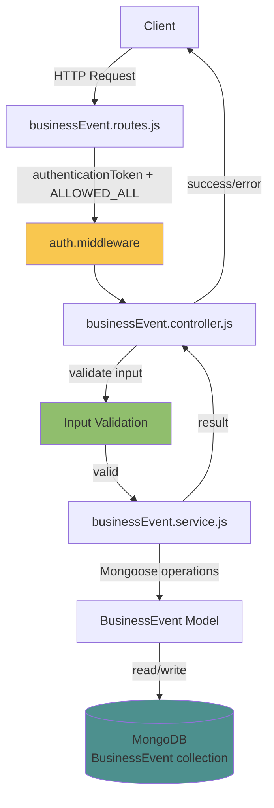

# Design Document: Invoice Ingestion API

## Overview

API này xây dựng ba endpoint RESTful trong MODULE_BE (Express.js + Mongoose) để nhận, lưu trữ và truy vấn dữ liệu hóa đơn cửa hàng. Dữ liệu được lưu vào collection `BusinessEvent` trong MongoDB theo `businessEventSchema` đã có sẵn.

Thiết kế tuân theo pattern **Controller → Service → Schema** hiện tại của dự án:
- **Controller** xử lý HTTP request/response, validate input, gọi service
- **Service** chứa business logic, tương tác với Mongoose model
- **Schema** (đã có) định nghĩa cấu trúc dữ liệu MongoDB

### Endpoints

| Method | Path | Mô tả |
|--------|------|-------|
| `POST` | `/api/v1/business-event` | Upsert hóa đơn theo `event_code` |
| `GET` | `/api/v1/business-event?locationId=...` | Danh sách hóa đơn theo location |
| `GET` | `/api/v1/business-event/:eventCode` | Chi tiết một hóa đơn |

---

## Architecture



Luồng xử lý:
1. Request đến router → middleware xác thực token
2. Controller nhận request, validate các trường bắt buộc và ràng buộc số
3. Controller gọi service tương ứng
4. Service thực hiện Mongoose query (upsert / find / findOne)
5. Controller trả về response qua `success()` hoặc ném lỗi qua `error()`
6. `catchAsync` bắt mọi lỗi không xử lý và chuyển sang Express error handler

---

## Components and Interfaces

### 1. Route — `src/routes/businessEvent.routes.js`

```
POST   /          → authenticationToken, ALLOWED_ALL → upsertBusinessEvent
GET    /          → authenticationToken, ALLOWED_ALL → getBusinessEvents
GET    /:eventCode → authenticationToken, ALLOWED_ALL → getBusinessEventDetail
```

Đăng ký trong `src/routes/index.route.js`:
```js
app.use(`${version}/business-event`, businessEventRoutes);
```

### 2. Controller — `src/controllers/businessEvent.controller.js`

| Function | HTTP | Mô tả |
|----------|------|-------|
| `upsertBusinessEvent` | POST `/` | Validate body, gọi `service.upsertBusinessEvent()` |
| `getBusinessEvents` | GET `/` | Validate `locationId` query param, gọi `service.getBusinessEvents()` |
| `getBusinessEventDetail` | GET `/:eventCode` | Gọi `service.getBusinessEventDetail()` |

**Validation logic trong controller:**
- `upsertBusinessEvent`: kiểm tra `location_id`, `event_code`, `date` có mặt; kiểm tra `date` parse được; kiểm tra `total_amount >= 0`, `discount >= 0`; kiểm tra từng phần tử `event_details` có `quantity >= 0`, `unit_price >= 0`
- `getBusinessEvents`: kiểm tra `locationId` có mặt

### 3. Service — `src/service/businessEvent.service.js`

| Function | Mô tả |
|----------|-------|
| `upsertBusinessEvent(data)` | `findOneAndUpdate` với `{ upsert: true }` theo `event_code` |
| `getBusinessEvents({ locationId, startDate, endDate, status })` | `find` với filter động, sort `date: -1` |
| `getBusinessEventDetail(eventCode)` | `findOne` theo `event_code`, ném 404 nếu không tìm thấy |

### 4. Schema — `src/schemas/businessEvent.schema.js` (đã có sẵn)

Không cần thay đổi. Schema đã có index trên `location_id`, `event_code`, `date`.

---

## Data Models

### BusinessEvent Document

```js
{
  _id: ObjectId,
  location_id: String,       // required, ref: 'Location'
  event_code: String,        // required, unique — khóa upsert
  type: String,              // optional
  total_amount: Number,      // default: 0, >= 0
  discount: Number,          // default: 0, >= 0
  payment_method: String,    // optional
  status: String,            // optional, dùng để filter
  date: Date,                // required
  event_details: [           // optional array
    {
      item_id: String,       // ref: 'Asset'
      item_name: String,
      quantity: Number,      // default: 0, >= 0
      unit_price: Number,    // default: 0, >= 0
      total_price: Number    // default: 0
    }
  ],
  created_at: Date,          // auto (timestamps)
  updated_at: Date           // auto (timestamps)
}
```

### Request/Response Shapes

**POST `/api/v1/business-event` — Request body:**
```json
{
  "location_id": "LOC001",
  "event_code": "INV-2024-001",
  "date": "2024-01-15T10:30:00Z",
  "type": "sale",
  "total_amount": 150000,
  "discount": 10000,
  "payment_method": "cash",
  "status": "completed",
  "event_details": [
    {
      "item_id": "ASSET001",
      "item_name": "Product A",
      "quantity": 2,
      "unit_price": 75000,
      "total_price": 150000
    }
  ]
}
```

**Response thành công (200):**
```json
{
  "status": "success",
  "code": 200,
  "message": "Business event saved successfully",
  "data": { /* BusinessEvent document */ },
  "meta": {}
}
```

**GET `/api/v1/business-event?locationId=LOC001&startDate=2024-01-01&endDate=2024-01-31&status=completed`**

**Response (200):**
```json
{
  "status": "success",
  "code": 200,
  "message": "Business events retrieved successfully",
  "data": [ /* array of BusinessEvent documents, sorted date desc */ ],
  "meta": {}
}
```

**GET `/api/v1/business-event/:eventCode`**

**Response (200):**
```json
{
  "status": "success",
  "code": 200,
  "message": "Business event retrieved successfully",
  "data": { /* full BusinessEvent document including event_details */ },
  "meta": {}
}
```

### Query Filter Logic (Service)

```js
// getBusinessEvents
const query = { location_id: locationId };
if (startDate || endDate) {
  query.date = {};
  if (startDate) query.date.$gte = new Date(startDate);
  if (endDate)   query.date.$lte = new Date(endDate);
}
if (status) query.status = status;

return BusinessEvent.find(query).sort({ date: -1 });
```

---

## Correctness Properties

*A property is a characteristic or behavior that should hold true across all valid executions of a system — essentially, a formal statement about what the system should do. Properties serve as the bridge between human-readable specifications and machine-verifiable correctness guarantees.*

### Property 1: Upsert idempotency

*For any* valid invoice payload, gửi POST với cùng `event_code` hai lần liên tiếp (lần hai có thể có data khác) phải dẫn đến đúng một bản ghi trong MongoDB — không tạo bản ghi trùng — và bản ghi cuối cùng phản ánh dữ liệu của lần gửi thứ hai.

**Validates: Requirements 1.1, 1.6**

---

### Property 2: Upsert round-trip — dữ liệu được lưu và đọc lại đầy đủ

*For any* valid invoice payload (bao gồm `event_details` với số lượng phần tử tùy ý), sau khi POST thành công, GET `/:eventCode` phải trả về bản ghi có đầy đủ các trường đã gửi: `location_id`, `event_code`, `date`, và toàn bộ mảng `event_details` với đúng số phần tử và giá trị.

**Validates: Requirements 1.2, 1.7, 3.1, 3.3**

---

### Property 3: Validation từ chối mọi trường số âm

*For any* invoice payload có ít nhất một trong các trường `total_amount`, `discount`, `event_details[*].quantity`, hoặc `event_details[*].unit_price` mang giá trị âm, POST phải trả về HTTP 400 và không lưu bất kỳ bản ghi nào vào MongoDB.

**Validates: Requirements 4.2, 4.3, 4.4, 4.5**

---

### Property 4: Danh sách hóa đơn được filter đúng theo location và sắp xếp giảm dần theo date

*For any* tập hóa đơn thuộc nhiều `location_id` khác nhau, GET `?locationId=X` phải trả về danh sách mà: (a) tất cả phần tử có `location_id = X`, và (b) với mọi cặp phần tử liền kề `(a, b)`, `a.date >= b.date`.

**Validates: Requirements 2.1, 2.6**

---

### Property 5: Filter theo khoảng thời gian là chính xác

*For any* tập hóa đơn và bất kỳ cặp `startDate`/`endDate` hợp lệ nào, tất cả hóa đơn trong kết quả trả về phải có `date` nằm trong khoảng `[startDate, endDate]`, và không có hóa đơn nào nằm trong khoảng đó bị bỏ sót khỏi kết quả.

**Validates: Requirements 2.3**

---

### Property 6: Filter theo status là chính xác

*For any* tập hóa đơn với nhiều giá trị `status` khác nhau và bất kỳ giá trị `status` filter nào, tất cả hóa đơn trong kết quả trả về phải có `status` khớp chính xác với giá trị filter đã cung cấp.

**Validates: Requirements 2.4**

---

## Error Handling

### HTTP Status Codes

| Tình huống | Status | Mô tả |
|-----------|--------|-------|
| Thiếu trường bắt buộc (`location_id`, `event_code`, `date`) | 400 | Bad Request |
| `date` không phải định dạng ngày hợp lệ | 400 | Bad Request |
| Giá trị số âm (`total_amount`, `discount`, `quantity`, `unit_price`) | 400 | Bad Request |
| Thiếu `locationId` trong GET list | 400 | Bad Request |
| `eventCode` không tồn tại (GET detail) | 404 | Not Found |
| Token không hợp lệ hoặc thiếu | 401 | Unauthorized |
| Lỗi MongoDB / lỗi server | 500 | Internal Server Error |

### Error Response Format

Lỗi được ném qua `error()` từ `utils/response.js`, Express error handler trả về:
```json
{
  "status": "error",
  "code": 400,
  "message": "location_id is required",
  "errors": []
}
```

### Validation Strategy

Validation được thực hiện ở **controller layer** trước khi gọi service, theo pattern hiện tại của dự án (xem `member.controller.js`). Service chỉ ném lỗi cho các trường hợp business logic (404 not found, 500 DB error).

```
Controller validates:
  - Presence: location_id, event_code, date (POST)
  - Presence: locationId (GET list)
  - Format: date phải parse được thành Date hợp lệ
  - Range: total_amount >= 0, discount >= 0
  - Range: event_details[*].quantity >= 0, unit_price >= 0

Service throws:
  - 404: eventCode not found (GET detail)
  - 500: MongoDB errors (re-thrown via catchAsync → next)
```

---

## Testing Strategy

### Dual Testing Approach

Kết hợp **unit tests** (ví dụ cụ thể, edge cases) và **property-based tests** (universal properties trên nhiều input) để đạt coverage toàn diện.

### Property-Based Testing

Sử dụng **[fast-check](https://github.com/dubzzz/fast-check)** — thư viện PBT phổ biến cho JavaScript/Node.js, tương thích với Jest (đã có trong dự án qua `jest.config.js`).

Mỗi property test chạy tối thiểu **100 iterations**.

Tag format cho mỗi test:
```
// Feature: invoice-ingestion-api, Property {N}: {property_text}
```

**Property tests cần implement:**

| Property | Test | Generators |
|----------|------|-----------|
| P1: Upsert idempotency | POST cùng event_code 2 lần → 1 bản ghi, data = lần 2 | `fc.record({ location_id, event_code, date, ... })` |
| P2: Upsert round-trip | POST → GET detail → fields match | `fc.record(...)` với `event_details` tùy ý |
| P3: Negative values rejected | Payload với ít nhất 1 trường âm → 400, không lưu | `fc.record(...)` với `fc.integer({ max: -1 })` |
| P4: Sort date desc | GET list → mọi cặp liền kề `a.date >= b.date` | `fc.array(fc.record({ date: fc.date() }))` |
| P5: Date range filter | GET với startDate/endDate → tất cả kết quả trong khoảng | `fc.tuple(fc.date(), fc.date())` |
| P6: Status filter | GET với status → tất cả kết quả có status khớp | `fc.string()` cho status |

### Unit Tests

Tập trung vào:
- **Specific examples**: POST hợp lệ đầy đủ trường, GET list trả về mảng rỗng khi không có data
- **Error cases**: thiếu từng trường bắt buộc, token thiếu/sai
- **Integration points**: route → controller → service → model (với MongoDB in-memory hoặc mock)

### Test File Structure

```
MODULE_BE/
  src/
    __tests__/
      businessEvent.controller.test.js   # unit tests controller
      businessEvent.service.test.js      # unit + property tests service
      businessEvent.routes.test.js       # integration tests (supertest)
```

### Recommended Libraries

- **Jest** (đã có) — test runner
- **fast-check** — property-based testing
- **mongodb-memory-server** — MongoDB in-memory cho integration tests (không cần mock Mongoose)
- **supertest** — HTTP integration tests cho Express routes
