# Tài liệu Kiến trúc Cơ sở Dữ liệu - SpaceLens (Capstone 2)

---

## 1. Tổng quan

SpaceLens là một **nền tảng SaaS (Software as a Service)** phân tích hành vi không gian đa ngành, hỗ trợ nhiều mô hình kinh doanh khác nhau như:

- **Bán lẻ (Retail)** - Phân tích hành vi mua sắm
- **Phòng Gym** - Theo dõi hoạt động tập luyện
- **Văn phòng (Office)** - Quản lý không gian làm việc

### Nguyên tắc Thiết kế

Kiến trúc Database được thiết kế theo hai hướng tiếp cận song song:

1. **Normalization (Chuẩn hóa)** - Áp dụng cho luồng dữ liệu AI để:
   - Chịu tải cao với khối lượng dữ liệu tracking lớn
   - Tối ưu hóa việc ghi dữ liệu liên tục từ AI models
   - Tách biệt các concern để scale độc lập

2. **Embedded Documents** - Áp dụng cho thông tin cấu hình để:
   - Tối ưu hóa truy vấn MongoDB
   - Giảm số lượng JOIN operations
   - Tăng tốc độ đọc dữ liệu cấu hình

### Cấu trúc Hệ thống

Hệ thống bao gồm **11 Collections (Bảng)** được tổ chức thành **4 phân hệ chính**:

| Phân hệ | Số lượng Collections | Mục đích |
|---------|---------------------|----------|
| **Core Infrastructure** | 5 | Quản lý hạ tầng, cấu hình platform |
| **AI Core Data** | 3 | Tracking và phân tích hành vi |
| **Analytics** | 5 | Báo cáo và chỉ số kinh doanh |
| **GenAI Chatbot** | 1 | Trợ lý ảo thông minh |

---

## 2. Sơ đồ Thực thể Liên kết (ERD)

> **Lưu ý:** Sơ đồ dưới đây sử dụng cú pháp Mermaid. Các IDE như VSCode (cài extension Mermaid) hoặc GitHub/GitLab sẽ tự động render đoạn code này thành hình ảnh.

```mermaid
classDiagram
    %% ==========================================
    %% 1. CORE INFRASTRUCTURE (HẠ TẦNG PLATFORM)
    %% ==========================================
    
    class Locations {
        +ObjectId _id
        +String location_code
        +String name
        +String address
        +Enum type_model
        +Object manager_info
        +Object business_hours
        +Timestamp created_at
        +Timestamp updated_at
    }
    
    class Manager_Info {
        <<embedded>>
        +String name
        +String phone
        +String email
    }
    
    class Business_Hours {
        <<embedded>>
        +String open
        +String close
        +String timezone
    }
    
    Locations "1" --> "1" Manager_Info : obj
    Locations "1" --> "1" Business_Hours : obj
    
    class Users {
        +ObjectId _id
        +String account
        +String password
        +String email
        +Enum role
        +ObjectId location_id
        +Timestamp created_at
        +Timestamp updated_at
    }
    
    class Cameras {
        +ObjectId _id
        +ObjectId location_id
        +String camera_name
        +String camera_code
        +String rtsp_url
        +Enum status
        +Timestamp last_heartbeat
        +Date installation_date
        +Object camera_spec
        +Object camera_state
        +Object ai_config
        +Timestamp created_at
        +Timestamp updated_at
    }
    
    class Camera_Spec {
        <<embedded>>
        +Object max_resolution
        +Object current_resolution
    }
    
    class Camera_State {
        <<embedded>>
        +Timestamp last_processed_time
        +Timestamp last_stop_time
    }
    
    class AI_Config {
        <<embedded>>
        +Array active_models
        +Int processing_fps
        +Float confidence_threshold
    }
    
    Cameras "1" --> "1" Camera_Spec : obj
    Cameras "1" --> "1" Camera_State : obj
    Cameras "1" --> "1" AI_Config : obj
    
    class Zones {
        +ObjectId _id
        +ObjectId location_id
        +ObjectId camera_id
        +String zone_name
        +Enum function_type
        +Object thresholds
        +Array polygon_coordinates
        +Timestamp created_at
        +Timestamp updated_at
    }
    
    class Zone_Thresholds {
        <<embedded>>
        +Int min_duration_sec
        +Int engaged_duration_sec
    }
    
    Zones "1" --> "1" Zone_Thresholds : obj
    
    class Assets {
        +ObjectId _id
        +ObjectId location_id
        +String category_name
        +String name_product
        +String brand
        +Decimal price
        +String unit
        +Int stock_quantity
        +Boolean status
        +Object attributes
        +Timestamp created_at
        +Timestamp updated_at
    }
    
    class Asset_Attributes {
        <<embedded>>
        +String maintenance_date
        +String color
        +String custom_note
    }
    
    Assets "1" --> "1" Asset_Attributes : obj
    
    %% ==========================================
    %% 2. AI CORE DATA (TRACKING & BEHAVIOR)
    %% ==========================================
    
    class Sessions {
        +ObjectId _id
        +ObjectId location_id
        +String session_uuid
        +String person_id
        +Array reid_vector
        +Enum customer_type
        +Timestamp entry_time
        +Timestamp exit_time
        +Int total_dwell_time_seconds
    }
    
    class Trajectories {
        +ObjectId _id
        +ObjectId session_id
        +ObjectId camera_id
        +Array path_data
    }
    
    class Path_Data {
        <<embedded>>
        +Int x
        +Int y
        +BigInt timestamp
    }
    
    Trajectories "1" --> "*" Path_Data : array
    
    class InteractionLogs {
        +ObjectId _id
        +ObjectId session_id
        +ObjectId location_id
        +ObjectId zone_id
        +ObjectId asset_id
        +Enum event_type
        +Timestamp start_time
        +Timestamp end_time
        +Timestamp last_heartbeat
        +Int duration_seconds
        +Enum status
        +Enum interaction_class
    }
    
    %% ==========================================
    %% 3. ANALYTICS (BÁO CÁO & KINH DOANH)
    %% ==========================================
    
    class BusinessEvents {
        +ObjectId _id
        +ObjectId location_id
        +String event_code
        +Enum type
        +Decimal total_amount
        +Decimal discount
        +String payment_method
        +Enum status
        +Array event_details
        +Timestamp date
        +Timestamp created_at
        +Timestamp updated_at
    }
    
    class Event_Details {
        <<embedded>>
        +ObjectId item_id
        +String item_name
        +Int quantity
        +Decimal unit_price
        +Decimal total_price
    }
    
    BusinessEvents "1" --> "*" Event_Details : array
    
    class Heatmap {
        +ObjectId _id
        +ObjectId location_id
        +ObjectId camera_id
        +Date date
        +BigInt time_stamp
        +Int width_matrix
        +Int height_matrix
        +Int grid_size
        +Int frame_width
        +Int frame_height
        +Array heatmap_matrix
        +Timestamp created_at
        +Timestamp updated_at
    }
    
    class LocationStats {
        +ObjectId _id
        +ObjectId location_id
        +Date date
        +Object kpis
        +Object realtime
        +Array chart_data
        +Array top_assets
        +Timestamp created_at
        +Timestamp updated_at
    }
    
    class KPIs {
        <<embedded>>
        +Int total_visitors
        +Decimal total_revenue
        +Int total_events
        +Decimal conversion_rate
        +Int avg_store_dwell_time
        +Decimal avg_basket_value
    }
    
    class Realtime {
        <<embedded>>
        +Int people_current
        +Int checkout_length
    }
    
    class Chart_Data {
        <<embedded>>
        +Int hour
        +Int people_count
        +Decimal total_revenue
    }
    
    class Top_Assets {
        <<embedded>>
        +ObjectId asset_id
        +String asset_name
        +Int total_quantity
        +Decimal total_revenue
        +Int rank
    }
    
    LocationStats "1" --> "1" KPIs : obj
    LocationStats "1" --> "1" Realtime : obj
    LocationStats "1" --> "*" Chart_Data : array
    LocationStats "1" --> "*" Top_Assets : array
    
    class ZoneStats {
        +ObjectId _id
        +ObjectId location_id
        +ObjectId zone_id
        +Date date
        +Object performance
        +String trend
        +Timestamp created_at
        +Timestamp updated_at
    }
    
    class Performance {
        <<embedded>>
        +Int performance_people_count
        +Decimal total_sales_value
        +Int total_events
        +Decimal conversion_rate
        +Int avg_dwell_time
        +Int total_stop_events
        +ObjectId top_asset_id
        +Int peak_hour
    }
    
    ZoneStats "1" --> "1" Performance : obj
    
    class FlowPatterns {
        +ObjectId _id
        +ObjectId location_id
        +String date_range
        +ObjectId source_zone_id
        +ObjectId target_zone_id
        +Float probability
    }
    
    %% ==========================================
    %% 4. MODULE CHATBOT (GenAI)
    %% ==========================================
    
    class ChatSessions {
        +ObjectId _id
        +ObjectId user_id
        +ObjectId location_id
        +String title
        +Array messages
        +Object metadata
        +Timestamp created_at
        +Timestamp updated_at
    }
    
    class Chat_Messages {
        <<embedded>>
        +Enum role
        +String content
        +Timestamp timestamp
    }
    
    ChatSessions "1" --> "*" Chat_Messages : array
    
    %% ==========================================
    %% LIÊN KẾT CHÍNH (LOGICAL REFS)
    %% ==========================================
    
    Locations "1" --> "*" Users : managed_by
    Locations "1" --> "*" Cameras : owns
    Locations "1" --> "*" Zones : contains
    Locations "1" --> "*" Assets : holds
    
    Cameras "1" --> "*" Zones : views
    Zones "1" .. "*" Assets : logical_link
    
    Locations "1" --> "*" Sessions : tracks
    Sessions "1" --> "1" Trajectories : path
    Sessions "1" --> "*" InteractionLogs : interacts
    
    InteractionLogs "*" .. "1" Zones : at
    InteractionLogs "*" .. "1" Assets : with
    
    Locations "1" --> "*" BusinessEvents : generates
    Locations "1" --> "*" Heatmap : reports
    Locations "1" --> "*" LocationStats : reports
    Locations "1" --> "*" FlowPatterns : reports
    Zones "1" --> "*" ZoneStats : detail_report
    
    Users "1" --> "*" ChatSessions : owns
```



---

## 3. Chi tiết các Phân hệ (Modules)

### 3.1. Nhóm Quản trị Hạ tầng (Infrastructure)

Quản lý các thực thể tĩnh và cấu hình cốt lõi của Platform.

| Bảng | Chức năng | Đặc điểm chú ý |
|------|-----------|----------------|
| **Locations** | Định nghĩa cơ sở kinh doanh (Cửa hàng, Gym, Office) | Chứa `type_model` quyết định luồng logic của các báo cáo |
| **Users** | Quản lý tài khoản truy cập hệ thống | Được phân quyền theo `role` (Admin/Manager/Staff) |
| **Cameras** | Thông tin kết nối luồng video RTSP | Chứa `ai_config` để bật/tắt động các model AI (Pose, ReID) giúp tiết kiệm GPU |
| **Zones** | Định nghĩa các khu vực ảo trên Camera | Chứa `thresholds` (ngưỡng thời gian) để phân loại hành vi xem lướt hay tương tác sâu |
| **Assets** | Quản lý tài sản (Sản phẩm bán lẻ hoặc Máy tập Gym) | Cột `attributes` lưu JSON linh hoạt mở rộng tùy theo `type_model` |

#### 3.1.1. Collection: Locations

**Mô tả:** Đại diện cho các địa điểm kinh doanh (cửa hàng, phòng gym, văn phòng).

**Schema chính:**

```javascript
{
  _id: ObjectId,
  location_code: String,        // Mã định danh duy nhất
  name: String,                  // Tên địa điểm
  address: String,
  type_model: Enum,              // "RETAIL" | "GYM" | "OFFICE"
  manager_info: {                // Embedded document
    name: String,
    phone: String,
    email: String
  },
  business_hours: {              // Embedded document
    open: String,                // "08:00"
    close: String,               // "22:00"
    timezone: String             // "Asia/Ho_Chi_Minh"
  },
  created_at: Timestamp,
  updated_at: Timestamp
}
```

**Index quan trọng:**
- `location_code` (unique)
- `type_model` (non-unique, dùng cho filter)

---

#### 3.1.2. Collection: Users

**Mô tả:** Quản lý người dùng hệ thống với phân quyền theo vai trò.

**Schema chính:**

```javascript
{
  _id: ObjectId,
  account: String,               // Username
  password: String,              // Hashed password
  email: String,
  role: Enum,                    // "ADMIN" | "MANAGER" | "STAFF"
  location_id: ObjectId,         // Reference to Locations
  created_at: Timestamp,
  updated_at: Timestamp
}
```

**Index quan trọng:**
- `account` (unique)
- `email` (unique)
- `location_id` (non-unique)

---

#### 3.1.3. Collection: Cameras

**Mô tả:** Quản lý camera và cấu hình AI processing.

**Schema chính:**

```javascript
{
  _id: ObjectId,
  location_id: ObjectId,         // Reference to Locations
  camera_name: String,
  camera_code: String,           // Mã định danh camera
  rtsp_url: String,              // RTSP stream URL
  status: Enum,                  // "ACTIVE" | "INACTIVE" | "ERROR"
  last_heartbeat: Timestamp,     // Heartbeat để monitor
  installation_date: Date,
  camera_spec: {                 // Embedded document
    max_resolution: {
      width: Int,
      height: Int
    },
    current_resolution: {
      width: Int,
      height: Int
    }
  },
  camera_state: {                // Embedded document
    last_processed_time: Timestamp,
    last_stop_time: Timestamp
  },
  ai_config: {                   // Embedded document
    active_models: Array,        // ["POSE", "REID", "DETECTION"]
    processing_fps: Int,         // FPS xử lý AI
    confidence_threshold: Float  // Ngưỡng confidence
  },
  created_at: Timestamp,
  updated_at: Timestamp
}
```

**Đặc điểm kỹ thuật:**
- `ai_config.active_models` cho phép bật/tắt model động để tiết kiệm GPU
- `last_heartbeat` dùng để phát hiện camera offline

**Index quan trọng:**
- `camera_code` (unique)
- `location_id` (non-unique)
- `status` (non-unique)

---

#### 3.1.4. Collection: Zones

**Mô tả:** Định nghĩa các khu vực quan tâm (ROI) trên camera.

**Schema chính:**

```javascript
{
  _id: ObjectId,
  location_id: ObjectId,         // Reference to Locations
  camera_id: ObjectId,           // Reference to Cameras
  zone_name: String,             // "Kệ sản phẩm A", "Máy chạy bộ 1"
  function_type: Enum,           // "ENTRANCE" | "CHECKOUT" | "PRODUCT_DISPLAY" | "EQUIPMENT"
  thresholds: {                  // Embedded document
    min_duration_sec: Int,       // Thời gian tối thiểu để tính tương tác
    engaged_duration_sec: Int    // Ngưỡng phân loại ENGAGED
  },
  polygon_coordinates: Array,    // [[x1,y1], [x2,y2], ...]
  created_at: Timestamp,
  updated_at: Timestamp
}
```

**Ứng dụng thực tế:**
- `min_duration_sec = 3`: Phải đứng >3s mới tính là tương tác
- `engaged_duration_sec = 10`: Đứng >10s = ENGAGED, ngược lại = GLANCE

**Index quan trọng:**
- `location_id, camera_id` (compound)
- `function_type` (non-unique)

---

#### 3.1.5. Collection: Assets

**Mô tả:** Quản lý tài sản/sản phẩm theo ngành nghề.

**Schema chính:**

```javascript
{
  _id: ObjectId,
  location_id: ObjectId,         // Reference to Locations
  category_name: String,         // "Điện thoại", "Máy chạy bộ"
  name_product: String,          // Tên sản phẩm/thiết bị
  brand: String,
  price: Decimal,
  unit: String,                  // "cái", "bộ"
  stock_quantity: Int,
  status: Boolean,               // true = còn hàng/khả dụng
  attributes: {                  // Flexible JSON
    maintenance_date: String,    // Dành cho GYM
    color: String,               // Dành cho RETAIL
    custom_note: String
  },
  created_at: Timestamp,
  updated_at: Timestamp
}
```

**Điểm mạnh:**
- `attributes` là flexible JSON cho phép mở rộng theo `type_model`

**Index quan trọng:**
- `location_id` (non-unique)
- `category_name` (non-unique)

---

### 3.2. Nhóm Dữ liệu AI Core (Tracking)

Tách biệt từ bảng `PersonTracking` cũ thành **3 bảng độc lập** để tối ưu hóa truy vấn Read/Write.

#### Kiến trúc tách bảng (Decomposition Strategy)

| Collection | Vai trò | Tần suất Write | Tần suất Read |
|------------|---------|----------------|---------------|
| **Sessions** | Bảng nhẹ nhất - Lưu danh tính khách | Thấp (1 lần/session) | Cao (Dashboard) |
| **Trajectories** | Bảng nặng nhất - Quỹ đạo chi tiết | Rất cao (mỗi 0.5s) | Thấp (chỉ vẽ heatmap) |
| **InteractionLogs** | Trái tim hệ thống - Sự kiện tương tác | Cao (heartbeat 30s-60s) | Cao (Analytics) |

---

#### 3.2.1. Collection: Sessions

**Mô tả:** Lưu thông tin phiên hoạt động của khách hàng.

**Schema chính:**

```javascript
{
  _id: ObjectId,
  location_id: ObjectId,         // Reference to Locations
  session_uuid: String,          // UUID duy nhất cho session
  person_id: String,             // ID tracking người (ReID)
  reid_vector: Array,            // Feature vector từ ReID model
  customer_type: Enum,           // "NEW" | "RETURNING"
  entry_time: Timestamp,         // Thời điểm vào
  exit_time: Timestamp,          // Thời điểm ra
  total_dwell_time_seconds: Int  // Tổng thời gian lưu trú
}
```

**Ứng dụng:**
- Đếm tổng số khách (Footfall)
- Phân tích khách mới vs khách quay lại
- Tính thời gian lưu trú trung bình

**Index quan trọng:**
- `session_uuid` (unique)
- `location_id, entry_time` (compound - cho dashboard)
- `person_id` (non-unique - tracking across sessions)

---

#### 3.2.2. Collection: Trajectories

**Mô tả:** Lưu quỹ đạo di chuyển chi tiết của khách hàng.

**Schema chính:**

```javascript
{
  _id: ObjectId,
  session_id: ObjectId,          // Reference to Sessions
  camera_id: ObjectId,           // Reference to Cameras
  path_data: [                   // Array of coordinates
    {
      x: Int,                    // Tọa độ X
      y: Int,                    // Tọa độ Y
      timestamp: BigInt          // Timestamp milliseconds
    }
  ]
}
```

**Đặc điểm kỹ thuật:**
- `path_data` có thể chứa hàng nghìn phần tử (1 điểm/0.5s trong 30 phút = 3600 điểm)
- **Chỉ dùng khi vẽ Heatmap động hoặc replay quỹ đạo**
- Không dùng cho dashboard thông thường

**Index quan trọng:**
- `session_id` (non-unique)
- `camera_id, timestamp` (compound - cho time-series queries)

**Optimization tips:**
- Có thể dùng TTL index để tự động xóa dữ liệu cũ sau 30-90 ngày
- Cân nhắc shard theo `camera_id` khi scale

---

#### 3.2.3. Collection: InteractionLogs

**Mô tả:** Nhật ký các sự kiện tương tác giữa khách hàng với zones/assets.

**Schema chính:**

```javascript
{
  _id: ObjectId,
  session_id: ObjectId,          // Reference to Sessions
  location_id: ObjectId,         // Reference to Locations
  zone_id: ObjectId,             // Reference to Zones
  asset_id: ObjectId,            // Reference to Assets (nullable)
  event_type: Enum,              // "ENTER_ZONE" | "EXIT_ZONE" | "VIEW_PRODUCT" | "USE_EQUIPMENT"
  start_time: Timestamp,         // Bắt đầu tương tác
  end_time: Timestamp,           // Kết thúc tương tác
  last_heartbeat: Timestamp,     // Heartbeat mechanism
  duration_seconds: Int,         // Thời lượng tương tác
  status: Enum,                  // "ACTIVE" | "COMPLETED"
  interaction_class: Enum        // "GLANCE" | "ENGAGED"
}
```

**Cơ chế Heartbeat (Core Innovation):**

Giải quyết bài toán: Làm sao theo dõi sự kiện kéo dài (VD: khách đứng xem hàng 5 phút) mà không sợ mất dữ liệu khi hệ thống sập?

**Workflow:**
1. Khi AI phát hiện khách bắt đầu tương tác → Insert record với `status = ACTIVE`
2. Cứ 30-60s, AI service cập nhật `last_heartbeat` và `duration_seconds`
3. Khi khách rời đi → Update `status = COMPLETED`, `end_time`
4. Background job quét các record có `last_heartbeat` quá cũ (>2 phút) → Tự động đóng với `status = COMPLETED`

**Phân loại tự động:**
- Nếu `duration_seconds < thresholds.engaged_duration_sec` → `GLANCE` (xem lướt)
- Ngược lại → `ENGAGED` (tương tác sâu)

**Index quan trọng:**
- `session_id` (non-unique)
- `location_id, zone_id` (compound - cho zone analytics)
- `status, last_heartbeat` (compound - cho background cleanup job)
- `start_time` (non-unique - time-series)

---

### 3.3. Nhóm Phân tích & Báo cáo (Analytics)

Biến dữ liệu thô thành chỉ số kinh doanh có thể hành động.

#### Chiến lược Pre-aggregation

Thay vì query trực tiếp từ `InteractionLogs` và `Sessions` (chậm), hệ thống chạy **Cron Jobs đêm** để tổng hợp sẵn metrics vào các bảng Analytics. Dashboard chỉ cần query các bảng này → **Tốc độ Real-time**.

---

#### 3.3.1. Collection: BusinessEvents

**Mô tả:** Thay thế cho hóa đơn (Invoices), lưu các sự kiện sinh lời.

**Schema chính:**

```javascript
{
  _id: ObjectId,
  location_id: ObjectId,         // Reference to Locations
  event_code: String,            // "INV-2024-001"
  type: Enum,                    // "PURCHASE" | "CHECK_IN" | "REFUND"
  total_amount: Decimal,
  discount: Decimal,
  payment_method: String,        // "CASH" | "CARD" | "E_WALLET"
  status: Enum,                  // "COMPLETED" | "PENDING" | "CANCELLED"
  event_details: [               // Array of line items
    {
      item_id: ObjectId,         // Reference to Assets
      item_name: String,
      quantity: Int,
      unit_price: Decimal,
      total_price: Decimal
    }
  ],
  date: Timestamp,
  created_at: Timestamp,
  updated_at: Timestamp
}
```

**Ứng dụng:**
- Tính doanh thu (Revenue)
- Phân tích giỏ hàng (Basket analysis)
- Tỷ lệ chuyển đổi (Conversion rate)

**Index quan trọng:**
- `event_code` (unique)
- `location_id, date` (compound - cho daily reports)
- `status` (non-unique)

---

#### 3.3.2. Collection: Heatmap

**Mô tả:** Lưu dữ liệu heatmap dưới dạng ma trận 2D.

**Schema chính:**

```javascript
{
  _id: ObjectId,
  location_id: ObjectId,         // Reference to Locations
  camera_id: ObjectId,           // Reference to Cameras
  date: Date,
  time_stamp: BigInt,            // Timestamp milliseconds
  width_matrix: Int,             // Số cột của ma trận
  height_matrix: Int,            // Số hàng của ma trận
  grid_size: Int,                // Kích thước mỗi ô (pixels)
  frame_width: Int,              // Độ rộng frame gốc
  frame_height: Int,             // Độ cao frame gốc
  heatmap_matrix: Array,         // Ma trận 2D (flattened hoặc nested)
  created_at: Timestamp,
  updated_at: Timestamp
}
```

**Cấu trúc `heatmap_matrix`:**

```javascript
// Option 1: Flattened array (hiệu quả hơn cho MongoDB)
heatmap_matrix: [0, 5, 10, 3, ..., 120]  // length = width_matrix * height_matrix

// Option 2: Nested array (dễ đọc hơn)
heatmap_matrix: [
  [0, 5, 10, 3],
  [2, 8, 15, 6],
  ...
]
```

**Ứng dụng:**
- Vẽ heatmap trên frontend
- Phân tích khu vực "nóng" (hot zones)

**Index quan trọng:**
- `location_id, camera_id, date` (compound)

---

#### 3.3.3. Collection: LocationStats

**Mô tả:** Thống kê tổng hợp theo địa điểm và ngày.

**Schema chính:**

```javascript
{
  _id: ObjectId,
  location_id: ObjectId,         // Reference to Locations
  date: Date,                    // Ngày thống kê
  kpis: {                        // Key Performance Indicators
    total_visitors: Int,
    total_revenue: Decimal,
    total_events: Int,
    conversion_rate: Decimal,    // % khách mua hàng
    avg_store_dwell_time: Int,   // Giây
    avg_basket_value: Decimal    // Giá trị giỏ hàng TB
  },
  realtime: {                    // Dữ liệu real-time (cập nhật liên tục)
    people_current: Int,         // Số người hiện tại
    checkout_length: Int         // Độ dài hàng thanh toán
  },
  chart_data: [                  // Dữ liệu cho biểu đồ theo giờ
    {
      hour: Int,                 // 0-23
      people_count: Int,
      total_revenue: Decimal
    }
  ],
  top_assets: [                  // Top sản phẩm/thiết bị
    {
      asset_id: ObjectId,
      asset_name: String,
      total_quantity: Int,
      total_revenue: Decimal,
      rank: Int
    }
  ],
  created_at: Timestamp,
  updated_at: Timestamp
}
```

**Đặc điểm:**
- **Pre-computed metrics** → Dashboard query nhanh
- `realtime` được cập nhật mỗi 5-10 phút
- `chart_data` và `top_assets` tính sẵn hàng đêm

**Index quan trọng:**
- `location_id, date` (compound, unique)

---

#### 3.3.4. Collection: ZoneStats

**Mô tả:** Thống kê chi tiết theo từng zone.

**Schema chính:**

```javascript
{
  _id: ObjectId,
  location_id: ObjectId,         // Reference to Locations
  zone_id: ObjectId,             // Reference to Zones
  date: Date,
  performance: {
    performance_people_count: Int,
    total_sales_value: Decimal,
    total_events: Int,
    conversion_rate: Decimal,
    avg_dwell_time: Int,
    total_stop_events: Int,
    top_asset_id: ObjectId,      // Asset nổi bật nhất
    peak_hour: Int               // Giờ cao điểm (0-23)
  },
  trend: String,                 // "INCREASING" | "STABLE" | "DECREASING"
  created_at: Timestamp,
  updated_at: Timestamp
}
```

**Ứng dụng:**
- So sánh hiệu quả giữa các zones
- Tối ưu layout cửa hàng

**Index quan trọng:**
- `location_id, zone_id, date` (compound)

---

#### 3.3.5. Collection: FlowPatterns

**Mô tả:** Phân tích luồng di chuyển giữa các zones.

**Schema chính:**

```javascript
{
  _id: ObjectId,
  location_id: ObjectId,         // Reference to Locations
  date_range: String,            // "2024-01-01_to_2024-01-07"
  source_zone_id: ObjectId,      // Zone xuất phát
  target_zone_id: ObjectId,      // Zone đích
  probability: Float             // Xác suất (0.0 - 1.0)
}
```

**Ứng dụng:**
- Vẽ Sankey diagram
- Tối ưu customer journey

**Ví dụ:**
```javascript
{
  source_zone_id: ObjectId("entrance"),
  target_zone_id: ObjectId("shoe_section"),
  probability: 0.75  // 75% khách từ cửa vào sẽ đi tới kệ giày
}
```

**Index quan trọng:**
- `location_id, date_range` (compound)
- `source_zone_id` (non-unique)

---

### 3.4. Nhóm Trợ lý ảo (GenAI Chatbot)

#### 3.4.1. Collection: ChatSessions

**Mô tả:** Lưu trữ ngữ cảnh trò chuyện giữa User và AI, hỗ trợ RAG (Retrieval-Augmented Generation).

**Schema chính:**

```javascript
{
  _id: ObjectId,
  user_id: ObjectId,             // Reference to Users
  location_id: ObjectId,         // Reference to Locations
  title: String,                 // "Phân tích doanh thu tháng 1"
  messages: [                    // Mảng tin nhắn
    {
      role: Enum,                // "USER" | "ASSISTANT"
      content: String,           // Nội dung tin nhắn
      timestamp: Timestamp
    }
  ],
  metadata: {                    // Metadata linh hoạt
    model_used: String,          // "gpt-4" | "claude-3"
    total_tokens: Int,
    context_sources: Array       // Danh sách nguồn dữ liệu đã dùng
  },
  created_at: Timestamp,
  updated_at: Timestamp
}
```

**Ứng dụng:**
- Lưu lịch sử chat
- Context cho RAG pipeline
- Phân tích xu hướng câu hỏi của users

```

**Index quan trọng:**
- `user_id` (non-unique)
- `location_id` (non-unique)
- `created_at` (non-unique - cho lịch sử)

---

## 4. Chiến lược Indexing và Performance

### 4.1. Index tổng hợp theo Collection

| Collection | Indexes | Lý do |
|------------|---------|-------|
| **Sessions** | `session_uuid` (unique)<br>`location_id, entry_time` (compound) | Query nhanh session theo location và thời gian |
| **InteractionLogs** | `session_id`<br>`location_id, zone_id`<br>`status, last_heartbeat` | Hỗ trợ cleanup job và zone analytics |
| **Trajectories** | `session_id`<br>`camera_id, timestamp` (compound) | Time-series queries cho heatmap |
| **LocationStats** | `location_id, date` (compound, unique) | Dashboard query theo ngày |
| **Heatmap** | `location_id, camera_id, date` (compound) | Query heatmap theo camera và ngày |


## 5. Data Flow Architecture

### 5.1. Luồng dữ liệu AI Processing

```
┌─────────────┐
│   Camera    │
│  (RTSP)     │
└──────┬──────┘
       │
       ▼
┌─────────────────────┐
│   AI Processing     │
│  - Person Detection │
│  - ReID Tracking    │
│  - Zone Detection   │
└──────┬──────────────┘
       │
       ├──────────────────────────────┬────────────────────┐
       ▼                              ▼                    ▼
┌─────────────┐            ┌──────────────────┐  ┌─────────────────┐
│  Sessions   │            │ InteractionLogs  │  │  Trajectories   │
│  (Lightweight)│            │  (Core Business) │  │  (Heavy Data)   │
└─────────────┘            └──────────────────┘  └─────────────────┘
       │                              │
       └──────────────┬───────────────┘
                      ▼
              ┌────────────────┐
              │  Cron Jobs     │
              │  (Nightly)     │
              └────────┬───────┘
                       │
                       ├─────────────────┬──────────────┐
                       ▼                 ▼              ▼
              ┌──────────────┐  ┌─────────────┐  ┌────────────┐
              │ LocationStats│  │  ZoneStats  │  │  Heatmap   │
              └──────────────┘  └─────────────┘  └────────────┘
                       │
                       ▼
              ┌──────────────┐
              │  Dashboard   │
              │  (Frontend)  │
              └──────────────┘
```

### 5.2. Workflow chi tiết

#### Luồng 1: Session Tracking

1. Camera phát hiện người mới → Tạo `Sessions` với `person_id`
2. Người di chuyển → Update `Trajectories.path_data` liên tục
3. Người rời đi → Update `Sessions.exit_time` và `total_dwell_time_seconds`

#### Luồng 2: Interaction Logging

1. Người bước vào Zone → Insert `InteractionLogs` với `status=ACTIVE`
2. Heartbeat worker cập nhật `last_heartbeat` mỗi 30s
3. Người rời Zone → Update `status=COMPLETED`, tính `interaction_class`

#### Luồng 3: Business Analytics

1. **Cron Job 00:00 hàng ngày:**
   - Aggregation query từ `InteractionLogs` + `Sessions` + `BusinessEvents`
   - Tính toán KPIs
   - Upsert vào `LocationStats` và `ZoneStats`

2. **Real-time Worker (mỗi 5 phút):**
   - Count `Sessions` với `exit_time = null` → `people_current`
   - Update `LocationStats.realtime`

---

## 6. Mối quan hệ giữa các Collections

### 6.1. Reference Relationships (ObjectId)

```
Locations
    │
    ├──> Users (1:N)
    ├──> Cameras (1:N)
    │       └──> Zones (1:N)
    ├──> Assets (1:N)
    │
    ├──> Sessions (1:N)
    │       ├──> Trajectories (1:1)
    │       └──> InteractionLogs (1:N)
    │
    └──> Analytics Collections (1:N)
            ├──> BusinessEvents
            ├──> LocationStats
            └──> Heatmap
```

## 8. Kết luận

Kiến trúc Database của SpaceLens được thiết kế với các nguyên tắc:

✅ **Separation of Concerns** - Tách AI data và Business data

✅ **Optimized for Query Patterns** - Index phù hợp với use cases thực tế

✅ **Scalability** - Hỗ trợ sharding và horizontal scaling

✅ **Flexibility** - Embedded documents cho phép mở rộng theo business model

✅ **Reliability** - Heartbeat mechanism đảm bảo không mất dữ liệu

Thiết kế này đáp ứng được:
- Xử lý real-time tracking với độ trễ thấp
- Phân tích phức tạp mà không ảnh hưởng performance
- Mở rộng dễ dàng khi thêm locations hoặc features mới

---

## Phụ lục

### A. Enum Values Reference

```javascript
// type_model
["RETAIL", "GYM", "OFFICE"]

// role
["ADMIN", "MANAGER", "STAFF"]

// status (Camera)
["ACTIVE", "INACTIVE", "ERROR"]

// function_type (Zones)
["ENTRANCE", "CHECKOUT", "PRODUCT_DISPLAY", "EQUIPMENT"]

// customer_type
["NEW", "RETURNING"]

// event_type (InteractionLogs)
["ENTER_ZONE", "EXIT_ZONE", "VIEW_PRODUCT", "USE_EQUIPMENT"]

// status (InteractionLogs)
["ACTIVE", "COMPLETED"]

// interaction_class
["GLANCE", "ENGAGED"]

// type (BusinessEvents)
["PURCHASE", "CHECK_IN", "REFUND"]

// status (BusinessEvents)
["COMPLETED", "PENDING", "CANCELLED"]

// role (ChatSessions.messages)
["USER", "ASSISTANT"]
```


**Tài liệu được tạo bởi:** SpaceLens Architecture Team  
**Phiên bản:** 1.0  
**Ngày cập nhật:** 13/02/2024
```mermaidermaid
classDiagram    
